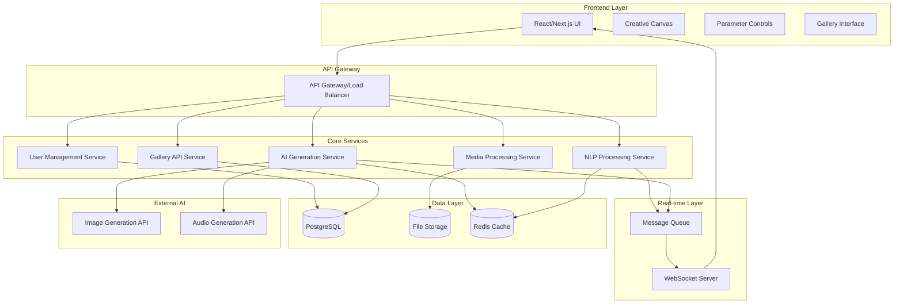

# AI Creative Studio Design Document

## Overview

The AI Creative Studio is a web-based platform that combines natural language processing, real-time AI generation, and collaborative features to enable creative content creation. The system architecture follows a microservices pattern with real-time capabilities, scalable AI processing, and robust data management for community features.

## Architecture

### High-Level Architecture



### Technology Stack

**Frontend:**
- React 18 with Next.js 14 for SSR and performance
- TypeScript for type safety
- Tailwind CSS for responsive design
- WebSocket client for real-time updates
- Web Audio API for audio playback and manipulation
- Canvas API for visual rendering and interactions

**Backend:**
- Node.js with Express.js for API services
- TypeScript for consistent development experience
- Socket.io for WebSocket management
- Bull Queue with Redis for job processing
- Prisma ORM for database operations

**Infrastructure:**
- PostgreSQL for relational data (users, creations, metadata)
- Redis for caching and session management
- AWS S3 or similar for file storage
- Docker containers for service deployment

**AI Integration:**
- OpenAI DALL-E or Midjourney API for image generation
- Stable Diffusion for local image processing
- OpenAI API or custom models for music generation
- Hugging Face Transformers for NLP processing

## Components and Interfaces

### 1. Natural Language Processing Service

**Purpose:** Parse user input into structured parameters for AI generation

**Key Components:**
- Text preprocessing and normalization
- Intent classification (visual vs audio vs mixed)
- Parameter extraction using NER (Named Entity Recognition)
- Sentiment analysis for mood interpretation
- Voice-to-text integration

**Interface:**
```typescript
interface NLPService {
  parseCreativeInput(input: string, type: 'visual' | 'audio' | 'mixed'): Promise<ParsedParameters>
  validateParameters(params: ParsedParameters): ValidationResult
  suggestImprovements(params: ParsedParameters): string[]
}

interface ParsedParameters {
  visual?: {
    style: string[]
    colors: string[]
    mood: string
    composition: string
    themes: string[]
  }
  audio?: {
    genre: string[]
    instruments: string[]
    tempo: number
    mood: string
    structure: string
  }
  confidence: number
  ambiguities: string[]
}
```

### 2. AI Generation Service

**Purpose:** Coordinate AI model calls and manage generation workflows

**Key Components:**
- Generation request orchestration
- Model selection and load balancing
- Result caching and optimization
- Progress tracking and status updates
- Error handling and retry logic

**Interface:**
```typescript
interface GenerationService {
  generateVisual(params: VisualParameters): Promise<GenerationResult>
  generateAudio(params: AudioParameters): Promise<GenerationResult>
  getGenerationStatus(jobId: string): Promise<GenerationStatus>
  cancelGeneration(jobId: string): Promise<void>
}

interface GenerationResult {
  id: string
  type: 'visual' | 'audio'
  url: string
  metadata: GenerationMetadata
  processingTime: number
}
```

### 3. Real-time Parameter Control System

**Purpose:** Handle live parameter updates and trigger regeneration

**Key Components:**
- WebSocket connection management
- Parameter validation and sanitization
- Debounced regeneration triggers
- State synchronization across clients
- Conflict resolution for collaborative editing

**Interface:**
```typescript
interface ParameterControlService {
  updateParameter(sessionId: string, param: string, value: any): Promise<void>
  subscribeToUpdates(sessionId: string, callback: UpdateCallback): void
  getParameterState(sessionId: string): Promise<ParameterState>
  resetParameters(sessionId: string): Promise<void>
}

interface ParameterState {
  visual: VisualParameters
  audio: AudioParameters
  lastModified: Date
  version: number
}
```

### 4. Gallery and Community Service

**Purpose:** Manage user creations, social features, and discovery

**Key Components:**
- Creation metadata management
- Search and filtering capabilities
- Social interaction tracking (likes, comments)
- Remix functionality
- Content moderation

**Interface:**
```typescript
interface GalleryService {
  saveCreation(creation: Creation): Promise<string>
  searchCreations(query: SearchQuery): Promise<Creation[]>
  getCreation(id: string): Promise<Creation>
  remixCreation(id: string, userId: string): Promise<RemixSession>
  addInteraction(creationId: string, interaction: Interaction): Promise<void>
}

interface Creation {
  id: string
  title: string
  description: string
  originalSpec: string
  parameters: ParsedParameters
  mediaUrls: string[]
  author: User
  tags: string[]
  stats: CreationStats
  createdAt: Date
}
```

### 5. Media Processing Service

**Purpose:** Handle file operations, format conversion, and export functionality

**Key Components:**
- File format conversion
- Quality optimization
- Batch processing for exports
- CDN integration
- Thumbnail generation

**Interface:**
```typescript
interface MediaService {
  exportCreation(creationId: string, format: ExportFormat): Promise<ExportResult>
  generateThumbnail(mediaUrl: string): Promise<string>
  optimizeForWeb(mediaUrl: string): Promise<string>
  validateMediaFile(file: File): ValidationResult
}

interface ExportFormat {
  type: 'image' | 'video' | 'audio'
  format: string // 'png', 'mp4', 'wav', etc.
  quality: 'low' | 'medium' | 'high'
  dimensions?: { width: number, height: number }
}
```

## Data Models

### Core Entities

```typescript
// User Management
interface User {
  id: string
  username: string
  email: string
  profile: UserProfile
  preferences: UserPreferences
  createdAt: Date
  lastActive: Date
}

interface UserProfile {
  displayName: string
  bio?: string
  avatar?: string
  socialLinks?: string[]
}

// Creation Management
interface Creation {
  id: string
  authorId: string
  title: string
  description: string
  originalSpec: string
  parsedParameters: ParsedParameters
  generatedMedia: MediaFile[]
  tags: string[]
  isPublic: boolean
  remixedFrom?: string
  stats: CreationStats
  createdAt: Date
  updatedAt: Date
}

interface MediaFile {
  id: string
  type: 'image' | 'video' | 'audio'
  url: string
  format: string
  size: number
  dimensions?: { width: number, height: number }
  duration?: number
}

interface CreationStats {
  views: number
  likes: number
  remixes: number
  comments: number
  exports: number
}

// Social Features
interface Comment {
  id: string
  creationId: string
  authorId: string
  content: string
  parentId?: string // for threaded comments
  createdAt: Date
}

interface Like {
  id: string
  creationId: string
  userId: string
  createdAt: Date
}

// Generation Sessions
interface GenerationSession {
  id: string
  userId: string
  currentParameters: ParameterState
  generationHistory: GenerationResult[]
  isActive: boolean
  createdAt: Date
  lastActivity: Date
}
```

### Database Schema Design

**PostgreSQL Tables:**
- `users` - User accounts and profiles
- `creations` - User-generated content metadata
- `media_files` - File storage references and metadata
- `comments` - Community comments and discussions
- `likes` - User interaction tracking
- `tags` - Content categorization
- `generation_sessions` - Active creation sessions
- `generation_jobs` - Background job tracking

**Redis Cache Structure:**
- `session:{sessionId}` - Active parameter states
- `generation:{jobId}` - Generation job status
- `user:{userId}:preferences` - User preferences cache
- `popular:creations` - Trending content cache

## Error Handling

### Error Categories and Responses

1. **Input Validation Errors**
   - Invalid natural language input
   - Malformed parameters
   - Unsupported file formats
   - Response: Clear error messages with suggestions

2. **AI Generation Failures**
   - Model API timeouts
   - Content policy violations
   - Resource limitations
   - Response: Retry mechanisms, alternative models, user notification

3. **System Errors**
   - Database connection issues
   - File storage failures
   - Network timeouts
   - Response: Graceful degradation, error logging, user-friendly messages

4. **Rate Limiting**
   - API quota exceeded
   - Too many concurrent requests
   - Response: Queue management, user notification, upgrade prompts

### Error Recovery Strategies

```typescript
interface ErrorHandler {
  handleGenerationFailure(error: GenerationError): Promise<RecoveryAction>
  handleNetworkError(error: NetworkError): Promise<RetryStrategy>
  handleValidationError(error: ValidationError): UserFeedback
}

enum RecoveryAction {
  RETRY_WITH_SAME_PARAMS,
  RETRY_WITH_MODIFIED_PARAMS,
  SUGGEST_ALTERNATIVE_APPROACH,
  ESCALATE_TO_SUPPORT
}
```

## Testing Strategy

### Unit Testing
- **NLP Service:** Test parameter parsing accuracy with diverse inputs
- **Generation Service:** Mock AI API responses and test error handling
- **Parameter Controls:** Validate real-time update logic and state management
- **Gallery Service:** Test CRUD operations and search functionality
- **Media Service:** Test file processing and format conversion

### Integration Testing
- **End-to-End Generation Flow:** From natural language input to final output
- **Real-time Parameter Updates:** WebSocket communication and state sync
- **Gallery Interactions:** Creation saving, searching, and social features
- **Export Functionality:** Complete export workflow with various formats

### Performance Testing
- **Concurrent User Load:** Test 1000+ simultaneous users
- **Generation Speed:** Validate 2-second generation targets
- **Real-time Responsiveness:** Parameter update latency under load
- **Database Performance:** Query optimization under high traffic
- **File Storage:** Upload/download performance with large media files

### User Acceptance Testing
- **Onboarding Flow:** New user experience and tutorial effectiveness
- **Creative Workflow:** Complete creation process from idea to export
- **Community Features:** Social interactions and content discovery
- **Cross-browser Compatibility:** Ensure consistent experience across platforms

### Automated Testing Pipeline
```yaml
# CI/CD Pipeline Testing Stages
stages:
  - lint_and_format
  - unit_tests
  - integration_tests
  - performance_tests
  - security_scans
  - deployment_tests
```

The design emphasizes scalability, real-time performance, and user experience while maintaining code quality and system reliability. The modular architecture allows for independent scaling of different services based on demand patterns.